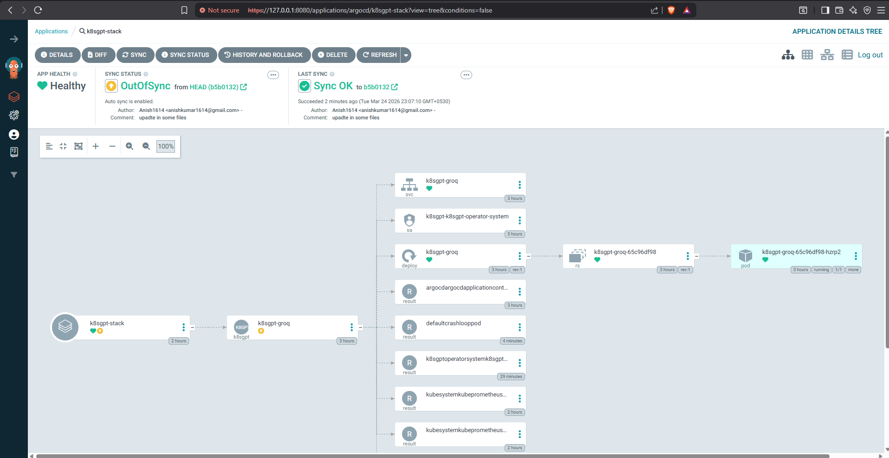
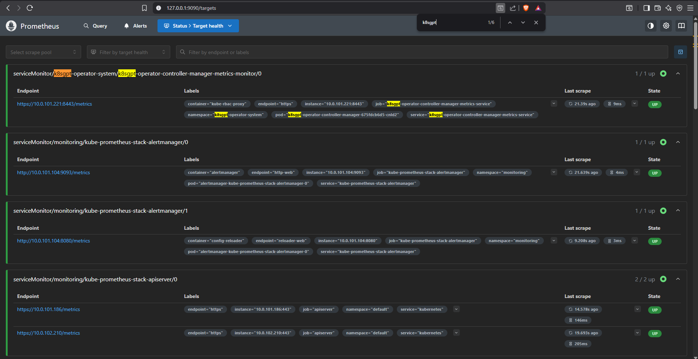
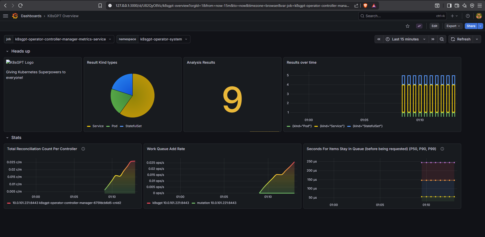

# 🤖 EKS AIOps with K8sGPT, ArgoCD & Grafana

AI-powered Kubernetes diagnostics on AWS EKS, fully automated with GitOps (ArgoCD), monitored via Prometheus + Grafana, and provisioned with Terraform.

K8sGPT scans the cluster for issues and generates AI-driven root cause analysis and remediation suggestions using LLM backends (Groq, OpenAI, Gemini, or AWS Bedrock).

---

## 📸 Screenshots

### ArgoCD — GitOps Dashboard


### K8sGPT — AI Scan Results


### Grafana — Cluster Monitoring


### Prometheus — K8sGPT Metrics Target


### K8sGPT — Grafana Dashboard


---

## 🏗️ Architecture

```
┌─────────────────────────────────────────────────────────┐
│                     AWS Cloud (us-east-1)                │
│  ┌──────────────────────────────────────────────────┐   │
│  │              VPC (10.0.0.0/16)                    │   │
│  │  ┌──────────────────────────────────────────┐    │   │
│  │  │         EKS Cluster (v1.32)              │    │   │
│  │  │                                          │    │   │
│  │  │  ┌──────────┐  ┌──────────────────────┐  │    │   │
│  │  │  │  ArgoCD  │  │  K8sGPT Operator     │  │    │   │
│  │  │  │ (GitOps) │  │  + Groq LLM Backend  │  │    │   │
│  │  │  └────┬─────┘  └──────────┬───────────┘  │    │   │
│  │  │       │                   │               │    │   │
│  │  │  Watches Git repo    Scans cluster &      │    │   │
│  │  │  & auto-syncs        generates AI fixes   │    │   │
│  │  │       │                   │               │    │   │
│  │  │  ┌────┴───────────────────┴────────────┐  │    │   │
│  │  │  │  Prometheus + Grafana (Monitoring)  │  │    │   │
│  │  │  └─────────────────────────────────────┘  │    │   │
│  │  └──────────────────────────────────────────┘    │   │
│  └──────────────────────────────────────────────────┘   │
└─────────────────────────────────────────────────────────┘
         │
    GitHub Repo ──── ArgoCD syncs from helm/k8sgpt/active/
```

---

## 📁 Project Structure

```
.
├── terraform/                  # Infrastructure as Code
│   ├── main.tf                 # Provider config (AWS, Kubernetes)
│   ├── vpc.tf                  # VPC with 2 public subnets
│   ├── eks.tf                  # EKS cluster (v1.32, t3.large nodes)
│   ├── irsa.tf                 # IAM Roles for Service Accounts (ArgoCD)
│   ├── variables.tf            # Region, cluster name
│   └── outputs.tf              # Cluster endpoint, kubeconfig command
│
├── helm/
│   ├── argocd/
│   │   └── application.yaml    # ArgoCD Application (watches helm/k8sgpt/active/)
│   └── k8sgpt/
│       ├── active/
│       │   └── k8sgpt-groq.yaml    # ✅ Active config (synced by ArgoCD)
│       ├── k8sgpt-groq.yaml        # Groq (Llama 3.1) — current backend
│       ├── k8sgpt-openai.yaml      # OpenAI backend (alternative)
│       ├── k8sgpt-gemini.yaml      # Google Gemini backend (alternative)
│       ├── k8sgpt-bedrock.yaml     # AWS Bedrock backend (alternative)
│       ├── k8sgpt-dashboard.json   # Custom Grafana dashboard
│       └── broken-pod.yaml         # Test pod (intentional CrashLoop)
│
├── docs/
│   └── resume.sh               # One-click setup script
│
├── image/                      # Screenshots for README
└── .gitignore
```

---

## 🛠️ Tech Stack

| Component | Tool | Purpose |
|-----------|------|---------|
| **Infrastructure** | Terraform | Provision EKS, VPC, IAM |
| **Kubernetes** | EKS v1.32 | Container orchestration |
| **AI Diagnostics** | K8sGPT + Groq | AI-powered cluster scanning |
| **GitOps** | ArgoCD | Auto-sync manifests from Git |
| **Monitoring** | Prometheus + Grafana | Metrics, dashboards, alerting |
| **Cert Management** | cert-manager | TLS certificates for operators |

---

## 🚀 Quick Start

### Prerequisites

- AWS CLI configured with appropriate permissions
- Terraform >= 1.5
- kubectl
- Helm 3
- A [Groq API key](https://console.groq.com/) (free tier available)

### 1. Provision Infrastructure

```bash
cd terraform
terraform init
terraform apply
```

```bash
# Update kubeconfig
aws eks update-kubeconfig --region us-east-1 --name eks-aiops-cluster
```

### 2. Install Dependencies

```bash
# cert-manager (required for K8sGPT operator)
kubectl apply -f https://github.com/cert-manager/cert-manager/releases/download/v1.14.0/cert-manager.yaml
kubectl wait --for=condition=available --timeout=300s deployment/cert-manager -n cert-manager

# K8sGPT Operator
helm repo add k8sgpt https://charts.k8sgpt.ai/
helm repo update
helm install k8sgpt-operator k8sgpt/k8sgpt-operator -n k8sgpt-operator-system --create-namespace
```

### 3. Configure K8sGPT with Groq

```bash
# Create API key secret
kubectl create secret generic groq-api-key \
  --from-literal=groq-api-key="YOUR_GROQ_API_KEY" \
  -n k8sgpt-operator-system

# Apply K8sGPT manifest  
kubectl apply -f helm/k8sgpt/active/k8sgpt-groq.yaml
```

### 4. Install ArgoCD

```bash
helm repo add argo https://argoproj.github.io/argo-helm
helm repo update
helm install argocd argo/argo-cd -n argocd --create-namespace

# Get admin password
kubectl get secret argocd-initial-admin-secret -n argocd -o jsonpath="{.data.password}" | base64 -d

# Access UI
kubectl port-forward svc/argocd-server -n argocd 8080:443
# Open: https://localhost:8080
```

### 5. Install Prometheus + Grafana

```bash
helm repo add prometheus-community https://prometheus-community.github.io/helm-charts
helm repo update
helm install kube-prometheus-stack prometheus-community/kube-prometheus-stack \
  -n monitoring --create-namespace

# Access Grafana
kubectl port-forward svc/kube-prometheus-stack-grafana -n monitoring 3000:80
# Open: http://localhost:3000 (admin / <password below>)

# Get Grafana password
kubectl get secret -n monitoring kube-prometheus-stack-grafana \
  -o jsonpath="{.data.admin-password}" | base64 --decode; echo
```

### 6. Enable K8sGPT Metrics in Grafana

```bash
# IMPORTANT: additionalLabels.release is required for Prometheus ServiceMonitor discovery
helm upgrade k8sgpt-operator k8sgpt/k8sgpt-operator \
  -n k8sgpt-operator-system \
  --set serviceMonitor.enabled=true \
  --set serviceMonitor.additionalLabels.release=kube-prometheus-stack \
  --set grafanaDashboard.enabled=true
```

### 7. Register ArgoCD Application

```bash
kubectl apply -f helm/argocd/application.yaml
```

ArgoCD will now watch `helm/k8sgpt/active/` in this repo and auto-sync any changes to the cluster.

---

## 🔁 One-Click Setup

For a fresh cluster setup, use the automated script:

```bash
export GROQ_API_KEY="your_groq_api_key"
chmod +x docs/resume.sh
./docs/resume.sh
```

---

## 🧪 Testing K8sGPT

Deploy a broken pod to test AI diagnostics:

```bash
kubectl apply -f helm/k8sgpt/broken-pod.yaml
```

After a few minutes, K8sGPT will detect the CrashLoopBackOff and generate an AI analysis:

```bash
# Check results
kubectl get results -A

# View detailed AI diagnosis
kubectl describe result <result-name> -n k8sgpt-operator-system
```

**Example AI output:**
> Error: Container 'crash' in pod 'crashloop-pod' is restarting indefinitely.
> 
> Solution:
> 1. Check pod logs with `kubectl logs crashloop-pod`
> 2. Inspect pod events with `kubectl describe pod crashloop-pod`
> 3. Check container image and configuration for errors

---

## 🔀 Switching AI Backends

Alternative K8sGPT backend configs are available in `helm/k8sgpt/`:

| File | Backend | Model | Status |
|------|---------|-------|--------|
| `k8sgpt-groq.yaml` | Groq (LocalAI) | Llama 3.1 8B Instant | ✅ Working |
| `k8sgpt-openai.yaml` | OpenAI | GPT-based | ✅ Working |
| `k8sgpt-gemini.yaml` | Google Gemini | Gemini | ⚠️ Known issues |
| `k8sgpt-bedrock.yaml` | AWS Bedrock | AWS-managed LLMs | ⚠️ Known issues |

To switch backends, copy the desired config to `helm/k8sgpt/active/`, commit, and push. ArgoCD will auto-sync the change.

---

## 🔗 Access Services

| Service | Command | URL |
|---------|---------|-----|
| **ArgoCD** | `kubectl port-forward svc/argocd-server -n argocd 8080:443` | https://localhost:8080 |
| **Grafana** | `kubectl port-forward svc/kube-prometheus-stack-grafana -n monitoring 3000:80` | http://localhost:3000 |
| **Prometheus** | `kubectl port-forward svc/kube-prometheus-stack-prometheus -n monitoring 9090:9090` | http://localhost:9090 |

---

## 🧹 Cleanup

```bash
# Delete K8sGPT resources
kubectl delete k8sgpt k8sgpt-groq -n k8sgpt-operator-system

# Destroy infrastructure
cd terraform
terraform destroy
```

---

## 📄 License

This project is for educational and demonstration purposes.